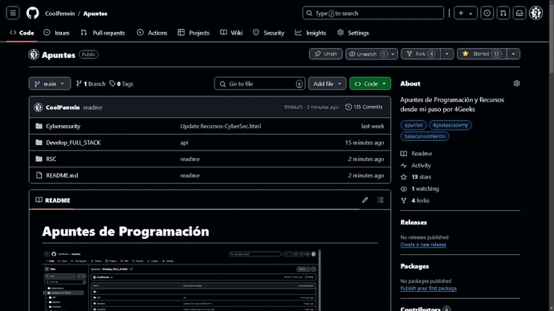

# Apuntes de Programación

## Descripción
Apuntes de programación generados a partir de lo aprendido durante mi paso por 4Geeks. Este repositorio incluye un manual de uso y una estructura clara para facilitar la búsqueda de información.

## Tabla de Contenidos
1. [Instalación](#instalación)
2. [Uso](#uso)
3. [Contribución](#contribución)
4. [Licencia](#licencia)

## Instalación
No se requiere instalación especial. Simplemente clona el repositorio en local dale estrellita y navega por los archivos para encontrar los apuntes que necesitas.

## Uso
Para utilizar estos apuntes, sigue la estructura de etiquetas HTML cambiando la palabra clave por el grupo  para encontrar y cerrar etiquetas correctamente. Aquí tienes un ejemplo de cómo están organizados los elementos principales y subgrupos:

### Ejemplo de Estructura de Etiquetas de Formulario

Etiquetas de formulario:

    <form>: 
        Definicion de un formulario.    // etiqueta Principal con contenido desplegado
                [...]
        <input>: Campo de entrada.      // etiqueta con contenido desplegado
                Texto (text): Permite al usuario ingresar texto.     
                Contraseña (password): Permite al usuario ingresar una contraseña, ocultando los caracteres.
                [...] 
        </input> 
        <label>:  [...]                 // etiqueta contraida 
        </label>
        <button>: [...]                 // etiqueta contraida 
        </button>

      </form>

## Estas etiquetas nos sirven para cerrar el contenido  y navegar comodamente

## Contribución
Si deseas contribuir a este repositorio, por favor sigue las siguientes pautas:
1. Haz un fork del proyecto.
2. Crea una nueva rama (`git checkout -b feature/nueva-funcionalidad`).
3. Realiza tus cambios y haz commit (`git commit -m 'Añadir nueva funcionalidad'`).
4. Haz push a la rama (`git push origin feature/nueva-funcionalidad`).
5. Abre un Pull Request.

Si solo quieres añadir algo de contenido (se puede hacer directamente desde GitHub):
1. Haz un fork del proyecto.
2. Realiza tus cambios y haz commit 
3. Abre un Pull Request.

### Contribuciones
- [Davinia](https://github.com/daviniapd) estuvo aquí.
- [Bea](https://github.com/Ruubia) estuvo aquí.
- Estuve aquí [Yara](https://github.com/Yaralisa).
- [Jumpvzl](https://github.com/Jumpvzl) estuvo aquí.
- [Edo](https://github.com/EduardoHernandezGuzman) estuvo aquí.
- [Nombre del Colaborador 1](https://github.com/eliasjr89): Rol o contribución específica.

## Licencia
Este proyecto está bajo la Licencia MIT.
